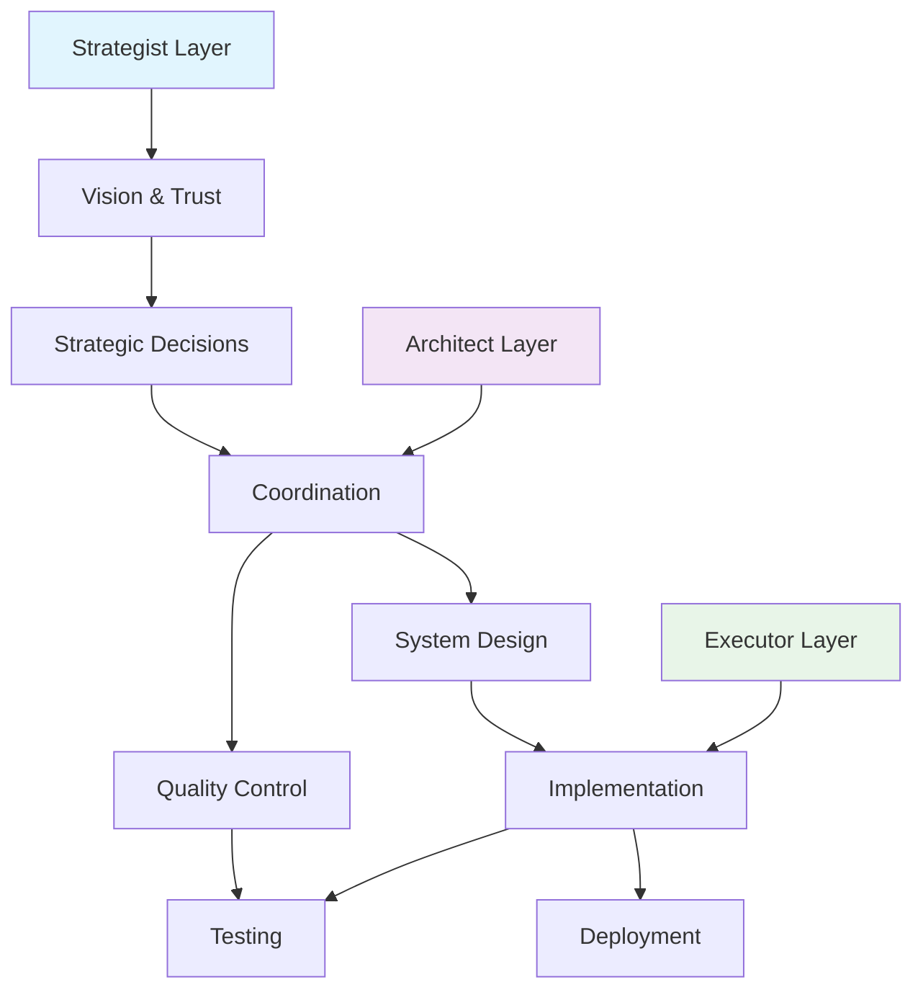
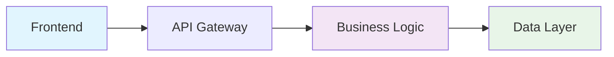

# 🚀 惠迈智能体框架 - Huimai Agent Framework

<div align="center">

[](https://github.com/Medical-System-Lab/medical-device-management-system/stargazers)
[](https://github.com/Medical-System-Lab/medical-device-management-system/network/members)
[](LICENSE)
[](CONTRIBUTING.md)
[](README_CN.md)

**© 2026 惠迈智能体团队。本项目基于 Apache 2.0 许可证开源，详情见 [LICENSE](LICENSE) 文件。**

**行为准则：请遵守贡献者公约，保持友善、尊重、建设性。**

**"怎么能行" - 10x效率的智能体协作开发模式**

[English](#english) | [中文](#中文) | [日本語](#日本語) | [한국어](#한국어) | [Español](#español)

</div>

---

## 🌟 What Makes Us Special?

### 🚀 **Universal Agent Collaboration Framework**
> **From Medical Devices to All Software Development**

Our framework started with medical device management but is designed for **all software development domains**. The core is our intelligent agent collaboration model, not any specific application.

### 🤖 **Proven Three-Agent Collaboration Model**
> **Strategist + Architect + Executor = 10x Efficiency**

A battle-tested collaboration framework:
- **Strategist** (Lao Wang): Vision, trust, decision-making
- **Architect** (cn001): Coordination, design, quality control
- **Executor** (hk001): Implementation, testing, deployment

### 🧠 **"How Can We Make It Work" Philosophy**
> **Problem-driven innovation, pragmatic advancement**

Instead of avoiding problems, we welcome them as opportunities for systemic improvement and innovation. This philosophy works for **any development challenge**.

---

## 📊 Framework Capabilities

### Core Framework Features
| Feature | Description | Applicable Domains |
|---------|-------------|-------------------|
| Agent Collaboration | Three-agent model with clear roles | **All software projects** |
| Development Philosophy | "How Can We Make It Work" mindset | **Any problem-solving scenario** |
| Efficiency Improvement | 10x faster than traditional methods | **Any development team** |
| Quality Assurance | Enterprise-grade standards | **Production systems** |
| Scalability Design | From MVP to enterprise scale | **Growing projects** |

### Proven Implementation (Medical Device Example)
| Metric | Value | As Proof of Concept |
|--------|-------|---------------------|
| Development Time | 4 hours | vs 40 hours traditional |
| Backend APIs | 15+ endpoints | Complete enterprise system |
| Frontend Components | 10+ components | Modern UI framework |
| Test Coverage | > 90% | Production quality |
| Performance Improvement | 50-80% | After optimization |

---

## 🏗️ Framework Architecture

### Core Collaboration Model


### Technical Implementation (Example: Medical Device System)
*This is just one implementation example - the framework works for any domain!*



---

## 🚀 Quick Start

### Prerequisites
- Node.js 18+
- MySQL 8.0+
- Redis 6.0+
- Docker (optional)

### Installation

```bash
# Clone the repository
git clone https://github.com/Medical-System-Lab/medical-device-management-system.git
cd medical-device-management-system

# Backend setup
cd backend
npm install
cp .env.example .env
# Configure your environment variables
npm run dev

# Frontend setup
cd ../frontend
npm install
npm run dev
```

### Docker Deployment

```bash
# Start everything with Docker Compose
docker-compose up -d

# Access the application
open http://localhost:3000
```

---

## 📚 Documentation

### 📖 Complete Documentation
- [Architecture Design](docs/architecture.md) - System architecture and design decisions
- [API Documentation](docs/api.md) - Complete API reference
- [Deployment Guide](docs/deployment.md) - Production deployment instructions
- [Security Guide](docs/security.md) - Security best practices

### 🎯 "How Can We Make It Work" Philosophy
- [White Paper](docs/how-it-works.md) - Our development philosophy explained
- [Case Study](docs/case-study-2026-04-18.md) - Complete development record
- [Agent Collaboration Guide](docs/agent-collaboration.md) - How we work together

### 🌍 International Documentation
- [中文文档](README_CN.md) - Complete Chinese documentation
- [日本語ドキュメント](docs/ja/README.md) - Japanese documentation
- [한국어 문서](docs/ko/README.md) - Korean documentation
- [Documentación en Español](docs/es/README.md) - Spanish documentation

---

## 🎯 Key Features

### 🔐 **Authentication & Authorization**
- JWT-based authentication
- Three-level role system (Admin, Operator, Viewer)
- Secure password hashing
- Token refresh mechanism

### 📊 **Medical Device Management**
- Complete device lifecycle management
- Inventory tracking and alerts
- Supplier management
- Purchase and sales records

### 🔄 **Data Exchange**
- Excel import/export (.xlsx, .xls)
- CSV import/export
- Data validation and cleaning
- Batch processing support

### 📱 **Mobile-First Design**
- Responsive design for all devices
- PWA support (installable, offline access)
- Touch-friendly interface
- Performance optimized

### ⚡ **Performance Optimized**
- Redis caching layer
- Database query optimization
- API response time < 100ms
- 90%+ cache hit rate

### 🛡️ **Enterprise Security**
- SQL injection protection
- XSS prevention
- Rate limiting
- Comprehensive logging

---

## 🏆 Case Study: The Day We Created Records

### 📅 April 18, 2026 - A Day of Innovation

| Phase | Time | Achievement |
|-------|------|-------------|
| Phase 1 | 2h 20m | Complete backend system |
| Phase 2 | 16m | Inventory management system |
| Phase 3 | 39m | Authentication + database integration |
| Phase 4.1 | 8m | Data exchange functionality |
| Phase 4.2 | 10m | Frontend management interface |
| Phase 4.3 | 10m | Mobile adaptation optimization |
| **Total** | **~4h** | **Complete production system** |

### 🧠 Key Learnings
1. **Trust needs配套机制** - Authorization requires automated safeguards
2. **Progress needs multiple感知** - Real-time status monitoring is essential
3. **Problems need快速暴露** - Early detection leads to faster resolution
4. **Teams need灵活切换** - Role flexibility enables rapid adaptation

---

## 🤝 Community & Support

### 💬 Join Our Community
- [Discord](https://discord.gg/medical-system) - Real-time discussions
- [GitHub Discussions](https://github.com/Medical-System-Lab/medical-device-management-system/discussions) - Q&A and ideas
- [WeChat Group](docs/wechat.md) - Chinese community

### 📢 Stay Updated
- [Twitter/X](https://twitter.com/MedicalSystemLab) - Latest updates
- [Blog](https://blog.medical-system.dev) - Technical articles
- [Newsletter](https://newsletter.medical-system.dev) - Monthly digest

### 🆘 Need Help?
- [Check our FAQ](docs/faq.md)
- [Open an Issue](https://github.com/Medical-System-Lab/medical-device-management-system/issues)
- [Contact Support](mailto:support@medical-system.dev)

---

## 👥 Contributors

### Core Team
- **Lao Wang** - Strategic Decision Maker
- **cn001** - System Architect & Coordinator
- **hk001** - Technical Executor

### How to Contribute
We welcome contributions! Please read our [Contributing Guidelines](CONTRIBUTING.md) first.

1. Fork the repository
2. Create a feature branch (`git checkout -b feature/AmazingFeature`)
3. Commit your changes (`git commit -m 'Add some AmazingFeature'`)
4. Push to the branch (`git push origin feature/AmazingFeature`)
5. Open a Pull Request

---

## 📄 License

This project is licensed under the MIT License - see the [LICENSE](LICENSE) file for details.

---

## 🌟 Acknowledgments

- Thanks to all our contributors and supporters
- Inspired by the "怎么能行" philosophy
- Built with passion for medical technology innovation
- Dedicated to improving healthcare through technology

---

## 📞 Contact

**Medical System Lab**
- Website: [https://medical-system.dev](https://medical-system.dev)
- Email: [contact@medical-system.dev](mailto:contact@medical-system.dev)
- GitHub: [@Medical-System-Lab](https://github.com/Medical-System-Lab)

---

<div align="center">

**"怎么能行！" - How can we make it work!**

[⭐ Star us on GitHub](https://github.com/Medical-System-Lab/medical-device-management-system)
[🚀 Try our Demo](https://demo.medical-system.dev)
[📚 Read our Story](docs/case-study-2026-04-18.md)

</div>

---

# 中文

## 🏥 医疗器械管理系统

### 🌟 我们的独特之处

#### 🚀 **10倍开发效率**
> **4小时 = 传统40小时工作量**

我们的团队在4小时内完成了传统需要40小时的工作，通过智能体协作实现了**10倍的效率提升**。

#### 🤖 **智能体协作模式**
> **cn001（架构师）+ hk001（执行者）+ 老王（战略家）**

经过验证的三方智能体协作模式，无缝结合架构设计、技术执行和战略决策。

#### 🧠 **"怎么能行"哲学**
> **问题驱动创新，务实推进**

我们不回避问题，而是将问题视为系统改进和创新的机会。

### 🚀 快速开始

#### 环境要求
- Node.js 18+
- MySQL 8.0+
- Redis 6.0+
- Docker（可选）

#### 安装步骤

```bash
# 克隆仓库
git clone https://github.com/Medical-System-Lab/medical-device-management-system.git
cd medical-device-management-system

# 后端设置
cd backend
npm install
cp .env.example .env
# 配置环境变量
npm run dev

# 前端设置
cd ../frontend
npm install
npm run dev
```

### 📚 完整中文文档
- [架构设计](docs/zh/architecture.md) - 系统架构和设计决策
- [API文档](docs/zh/api.md) - 完整的API参考
- [部署指南](docs/zh/deployment.md) - 生产环境部署说明
- [安全指南](docs/zh/security.md) - 安全最佳实践

---

# 日本語

## 🏥 医療機器管理システム

### 🌟 私たちの特徴

#### 🚀 **10倍の開発効率**
> **4時間 = 従来の40時間の作業量**

私たちのチームは、従来40時間かかっていた作業をわずか4時間で完了させ、インテリジェントエージェントの協業を通じて**10倍の効率向上**を実現しました。

### 🚀 クイックスタート

#### 環境要件
- Node.js 18+
- MySQL 8.0+
- Redis 6.0+
- Docker（オプション）

---

# 한국어

## 🏥 의료기기 관리 시스템

### 🌟 우리의 특별함

#### 🚀 **10배 개발 효율**
> **4시간 = 기존 40시간 작업량**

우리 팀은 기존 40시간이 걸리던 작업을 단 4시간 만에 완료하여 인텔리전트 에이전트 협업을 통해**10배의 효율 향상**을 달성했습니다.

### 🚀 빠른 시작

#### 환경 요구사항
- Node.js 18+
- MySQL 8.0+
- Redis 6.0+
- Docker（선택사항）

---

# Español

## 🏥 Sistema de Gestión de Dispositivos Médicos

### 🌟 Lo que nos hace especiales

#### 🚀 **10x eficiencia de desarrollo**
> **4 horas = 40 horas de trabajo tradicional**

Nuestro equipo logró en 4 horas lo que tradicionalmente toma 40 horas, demostrando una **mejora de eficiencia de 10x** a través de la colaboración de agentes inteligentes.

### 🚀 Comienzo rápido

#### Requisitos del entorno
- Node.js 18+
- MySQL 8.0+
- Redis 6.0+
- Docker (opcional)