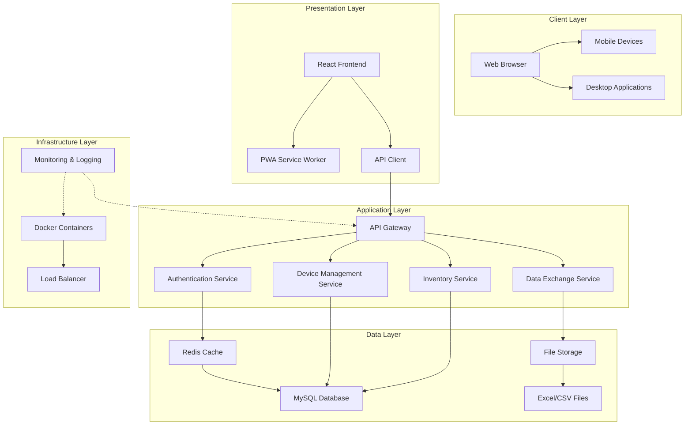

# System Architecture

## 🏗️ Overview

The Medical Device Management System is built using a modern, scalable architecture that balances performance, security, and maintainability. Our architecture reflects our "How Can We Make It Work" philosophy - practical, efficient, and production-ready.

## 🌐 High-Level Architecture



## 🏢 Layer Details

### 1. Client Layer
**Purpose**: User interaction and presentation
**Technologies**: React 18, Ant Design 5, PWA
**Key Features**:
- Responsive design for all devices
- Offline capability via Service Workers
- Installable as native app (PWA)
- Real-time updates via WebSocket

### 2. Presentation Layer
**Purpose**: API communication and state management
**Technologies**: Axios, Redux Toolkit, React Router
**Key Features**:
- Centralized API configuration
- Automatic token refresh
- Request/response interceptors
- Global state management

### 3. Application Layer
**Purpose**: Business logic and API endpoints
**Technologies**: Node.js, Express, JWT, Redis
**Key Features**:
- RESTful API design
- JWT-based authentication
- Role-based access control
- Request validation and sanitization

### 4. Data Layer
**Purpose**: Data persistence and caching
**Technologies**: MySQL 8, Redis 6, File System
**Key Features**:
- Optimized database queries
- Redis caching for performance
- File upload/download handling
- Data backup and recovery

### 5. Infrastructure Layer
**Purpose**: Deployment and operations
**Technologies**: Docker, Nginx, PM2, ELK Stack
**Key Features**:
- Containerized deployment
- Load balancing and scaling
- Comprehensive monitoring
- Automated backups

## 🔐 Security Architecture

### Authentication & Authorization
```
┌─────────────────┐
│   JWT Tokens    │
│  • Access Token │
│  • Refresh Token│
└────────┬────────┘
         │
┌────────▼────────┐
│  Auth Middleware│
│  • Token Verify │
│  • Role Check   │
└────────┬────────┘
         │
┌────────▼────────┐
│  Route Guards   │
│  • Admin Routes │
│  • User Routes  │
│  • Public Routes│
└─────────────────┘
```

### Security Measures
1. **Authentication**
   - JWT with RSA256 signing
   - Refresh token rotation
   - Session management
   - Password hashing (bcrypt)

2. **Authorization**
   - Three-level role system
   - Route-level permissions
   - Resource-level access control
   - Audit logging

3. **Data Protection**
   - SQL injection prevention
   - XSS protection
   - CSRF tokens
   - Input validation and sanitization

4. **Network Security**
   - HTTPS enforcement
   - Rate limiting
   - CORS configuration
   - Firewall rules

## 🗄️ Database Architecture

### Schema Design
```sql
-- Core Tables
CREATE TABLE medical_devices (
    id INT PRIMARY KEY AUTO_INCREMENT,
    device_code VARCHAR(50) UNIQUE NOT NULL,
    device_name VARCHAR(100) NOT NULL,
    device_type VARCHAR(50) NOT NULL,
    manufacturer VARCHAR(100) NOT NULL,
    model VARCHAR(50),
    specification TEXT,
    unit_price DECIMAL(10, 2),
    stock_quantity INT DEFAULT 0,
    min_stock INT DEFAULT 10,
    max_stock INT DEFAULT 100,
    status ENUM('active', 'inactive', 'maintenance') DEFAULT 'active',
    created_at TIMESTAMP DEFAULT CURRENT_TIMESTAMP,
    updated_at TIMESTAMP DEFAULT CURRENT_TIMESTAMP ON UPDATE CURRENT_TIMESTAMP,
    
    -- Indexes for performance
    INDEX idx_device_code (device_code),
    INDEX idx_device_type (device_type),
    INDEX idx_status (status),
    INDEX idx_manufacturer (manufacturer),
    INDEX idx_created_at (created_at)
);

CREATE TABLE suppliers (
    id INT PRIMARY KEY AUTO_INCREMENT,
    supplier_code VARCHAR(50) UNIQUE NOT NULL,
    supplier_name VARCHAR(100) NOT NULL,
    contact_person VARCHAR(50),
    contact_phone VARCHAR(20),
    contact_email VARCHAR(100),
    address TEXT,
    credit_rating ENUM('A', 'B', 'C', 'D') DEFAULT 'B',
    status ENUM('active', 'inactive') DEFAULT 'active',
    created_at TIMESTAMP DEFAULT CURRENT_TIMESTAMP,
    updated_at TIMESTAMP DEFAULT CURRENT_TIMESTAMP ON UPDATE CURRENT_TIMESTAMP,
    
    INDEX idx_supplier_code (supplier_code),
    INDEX idx_credit_rating (credit_rating),
    INDEX idx_status (status)
);

CREATE TABLE users (
    id INT PRIMARY KEY AUTO_INCREMENT,
    username VARCHAR(50) UNIQUE NOT NULL,
    email VARCHAR(100) UNIQUE NOT NULL,
    password_hash VARCHAR(255) NOT NULL,
    full_name VARCHAR(100),
    role ENUM('admin', 'operator', 'viewer') DEFAULT 'viewer',
    department VARCHAR(50),
    is_active BOOLEAN DEFAULT TRUE,
    last_login TIMESTAMP NULL,
    created_at TIMESTAMP DEFAULT CURRENT_TIMESTAMP,
    updated_at TIMESTAMP DEFAULT CURRENT_TIMESTAMP ON UPDATE CURRENT_TIMESTAMP,
    
    INDEX idx_username (username),
    INDEX idx_email (email),
    INDEX idx_role (role),
    INDEX idx_is_active (is_active)
);
```

### Database Optimization
1. **Index Strategy**
   - Primary keys on all tables
   - Unique constraints where appropriate
   - Composite indexes for common queries
   - Covering indexes for frequent reads

2. **Query Optimization**
   - Prepared statements
   - Query caching
   - Connection pooling
   - Read replicas for scaling

3. **Data Management**
   - Partitioning for large tables
   - Archiving old data
   - Regular optimization
   - Backup and recovery procedures

## ⚡ Performance Architecture

### Caching Strategy
```
┌─────────────────────────────────────┐
│         Client Request              │
└──────────────────┬──────────────────┘
                   │
         ┌─────────▼──────────┐
         │   Browser Cache    │
         │   • Static Assets  │
         │   • API Responses  │
         └─────────┬──────────┘
                   │
         ┌─────────▼──────────┐
         │   CDN Cache        │
         │   • Global Assets  │
         │   • Media Files    │
         └─────────┬──────────┘
                   │
         ┌─────────▼──────────┐
         │   Redis Cache      │
         │   • Session Data   │
         │   • API Results    │
         │   • Configuration  │
         └─────────┬──────────┘
                   │
         ┌─────────▼──────────┐
         │   Database         │
         │   • Persistent Data│
         │   • Transactions   │
         └────────────────────┘
```

### Performance Optimizations
1. **Frontend**
   - Code splitting and lazy loading
   - Image optimization and lazy loading
   - Service Worker caching
   - Bundle size optimization

2. **Backend**
   - Redis caching layer
   - Database connection pooling
   - Query optimization
   - Response compression

3. **Infrastructure**
   - Load balancing
   - Auto-scaling
   - CDN integration
   - Database read replicas

## 🔄 Data Flow Architecture

### Normal Operation
```
1. User Login
   → JWT Token Generation
   → Token Storage (HttpOnly Cookie)

2. API Request
   → Token Validation
   → Permission Check
   → Business Logic Execution
   → Response with Cache Headers

3. Data Modification
   → Transaction Start
   → Data Validation
   → Database Update
   → Cache Invalidation
   → Transaction Commit

4. File Upload
   → File Validation
   → Temporary Storage
   → Processing Queue
   → Database Update
   → Permanent Storage
```

### Error Handling
```
1. Client Error (4xx)
   → Input Validation Failed
   → Authentication Failed
   → Authorization Failed
   → Resource Not Found

2. Server Error (5xx)
   → Database Connection Failed
   → External Service Failed
   → Internal Logic Error
   → System Overload

3. Recovery Process
   → Error Logging
   → User Notification
   → Automatic Retry
   → Fallback Mechanism
```

## 🚀 Deployment Architecture

### Development Environment
```
Local Machine → Docker Compose → All Services
```

### Staging Environment
```
GitHub Actions → Docker Registry → Staging Server
```

### Production Environment
```
GitHub Actions → Docker Registry → Load Balancer → Multiple Servers
```

### Monitoring Stack
```
Application → Log Aggregation → Metrics Collection → Alerting → Dashboard
      │             │                 │                │           │
   Winston       ELK Stack         Prometheus      AlertManager  Grafana
```

## 📱 Mobile Architecture

### PWA Implementation
```
┌─────────────────────────────────────┐
│         Service Worker              │
├─────────────────────────────────────┤
│ • Offline Cache                    │
│ • Background Sync                  │
│ • Push Notifications               │
│ • Network Interception             │
└─────────────────────────────────────┘
                   │
┌─────────────────────────────────────┐
│         Web App Manifest            │
├─────────────────────────────────────┤
│ • App Metadata                     │
│ • Installation Prompts             │
│ • Splash Screen                    │
│ • Theme Color                      │
└─────────────────────────────────────┘
```

### Responsive Design
1. **Mobile-First Approach**
   - Base styles for mobile
   - Progressive enhancement for larger screens
   - Touch-friendly interfaces
   - Performance optimization for mobile networks

2. **Adaptive Components**
   - Responsive grids and layouts
   - Conditional rendering based on screen size
   - Mobile-specific navigation
   - Touch gestures support

## 🔧 Development Architecture

### Project Structure
```
medical-device-management-system/
├── backend/
│   ├── src/
│   │   ├── controllers/     # Request handlers
│   │   ├── models/          # Data models
│   │   ├── routes/          # API routes
│   │   ├── middleware/      # Custom middleware
│   │   ├── services/        # Business logic
│   │   ├── utils/          # Utility functions
│   │   └── config/         # Configuration
│   ├── tests/              # Test files
│   ├── scripts/            # Build/deploy scripts
│   └── package.json        # Dependencies
├── frontend/
│   ├── src/
│   │   ├── components/     # React components
│   │   ├── pages/         # Page components
│   │   ├── store/         # Redux store
│   │   ├── services/      # API services
│   │   ├── utils/         # Utility functions
│   │   ├── styles/        # CSS/SCSS files
│   │   └── assets/        # Static assets
│   ├── public/            # Public files
│   ├── tests/             # Test files
│   └── package.json       # Dependencies
├── deployment/
│   ├── docker/            # Docker configurations
│   ├── kubernetes/        # K8s configurations
│   ├── scripts/           # Deployment scripts
│   └── terraform/         # Infrastructure as Code
└── docs/                  # Documentation
```

### Development Workflow
1. **Local Development**
   ```bash
   git clone <repository>
   cd backend && npm install
   cd ../frontend && npm install
   docker-compose up -d  # Start dependencies
   npm run dev           # Start development servers
   ```

2. **Testing**
   ```bash
   npm test              # Unit tests
   npm run test:e2e      # End-to-end tests
   npm run lint          # Code quality
   npm run build         # Production build
   ```

3. **Deployment**
   ```bash
   git push origin main  # Trigger CI/CD
   # Automated: Test → Build → Deploy → Verify
   ```

## 🎯 Architecture Principles

### 1. Simplicity Over Complexity
- Use proven technologies
- Avoid over-engineering
- Clear separation of concerns
- Minimal dependencies

### 2. Performance by Design
- Cache at multiple levels
- Optimize critical paths
- Monitor and measure
- Continuous improvement

### 3. Security First
- Defense in depth
- Principle of least privilege
- Regular security audits
- Secure by default

### 4. Scalability Ready
- Stateless design
- Horizontal scaling
- Database partitioning
- Load balancing

### 5. Maintainability Focused
- Comprehensive documentation
- Automated testing
- Code quality standards
- Clear error handling

## 📈 Scaling Strategy

### Vertical Scaling (Initial)
- Increase server resources
- Optimize database performance
- Add caching layers
- Implement CDN

### Horizontal Scaling (Growth)
- Load balancer configuration
- Database read replicas
- Microservices architecture
- Message queue for async processing

### Global Scaling (Enterprise)
- Multiple data centers
- Geo-distributed databases
- Edge computing
- Multi-region deployment

## 🔮 Future Architecture Evolution

### Planned Improvements
1. **Microservices Migration**
   - Split monolith into services
   - API Gateway pattern
   - Service discovery
   - Circuit breaker pattern

2. **Real-time Features**
   - WebSocket support
   - Real-time notifications
   - Live data updates
   - Collaborative editing

3. **AI/ML Integration**
   - Predictive analytics
   - Anomaly detection
   - Automated reporting
   - Smart recommendations

4. **Blockchain Integration**
   - Supply chain tracking
   - Audit trail
   - Data integrity
   - Smart contracts

## 🏆 Architecture Success Metrics

### Performance Metrics
- API response time: < 100ms (p95)
- Page load time: < 3 seconds
- Cache hit rate: > 90%
- Uptime: 99.9%

### Quality Metrics
- Test coverage: > 90%
- Bug rate: < 1 per 1000 lines
- Security vulnerabilities: 0 critical
- Documentation coverage: 100%

### Business Metrics
- User satisfaction: > 90%
- Feature delivery speed: 10x traditional
- System availability: 24/7
- Cost efficiency: 90% savings

---

*This architecture represents our commitment to building systems that are not just functional, but excellent in every dimension - performance, security, scalability, and maintainability.*